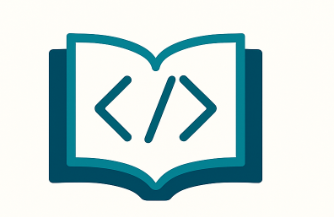

# CodeSummarizer

CodeSummarizer is a code comprehension project designed to help developers understand and summarize codebases efficiently.

## Features

- Analyze and summarize code files
- Extract key functions, classes, and documentation
- User-friendly interface for navigating code summaries

## Getting Started

1. **Clone the repository:**
    ```
    git clone https://github.com/yourusername/codeSummarizer.git
    cd codeSummarizer
    ```

3. **Run the application:**
   Run this on two server/terminal. One for Frontend and other for Backend
    ```
    python3 backend/app.py
    ```
    ```
    npm run dev
    ```

## Preview



<video src="Untitled video - Made with Clipchamp.mp4" controls width="600">
   Demo.
</video>


## Contributors

@EvanGlaizel
@damnnDaman

## License

This project is licensed under the MIT License.
